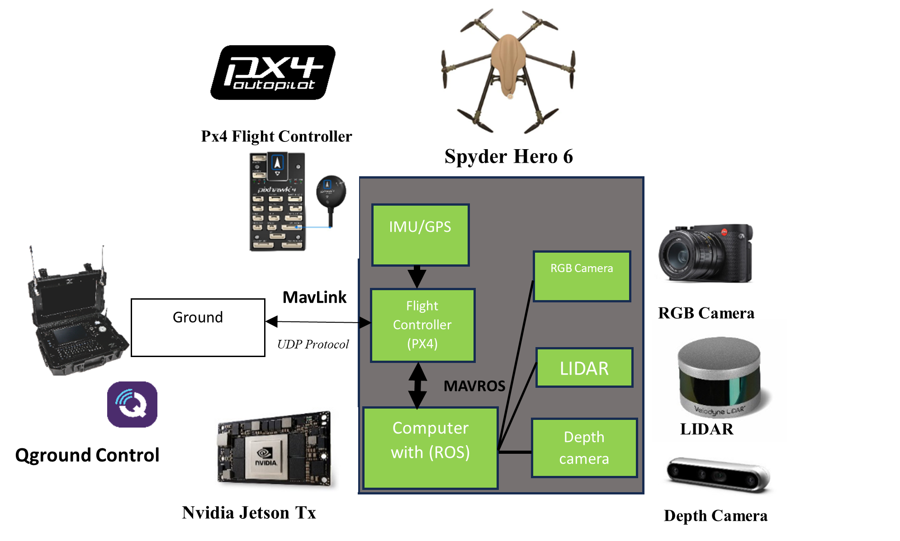
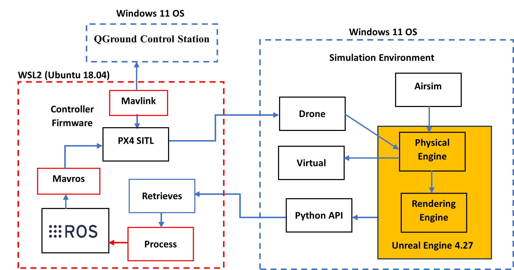
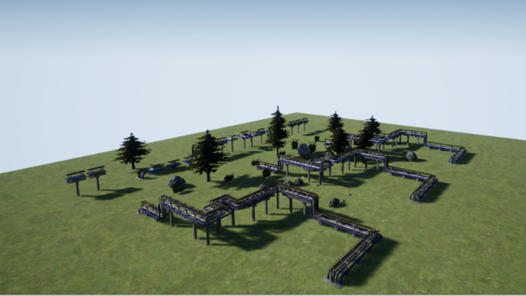
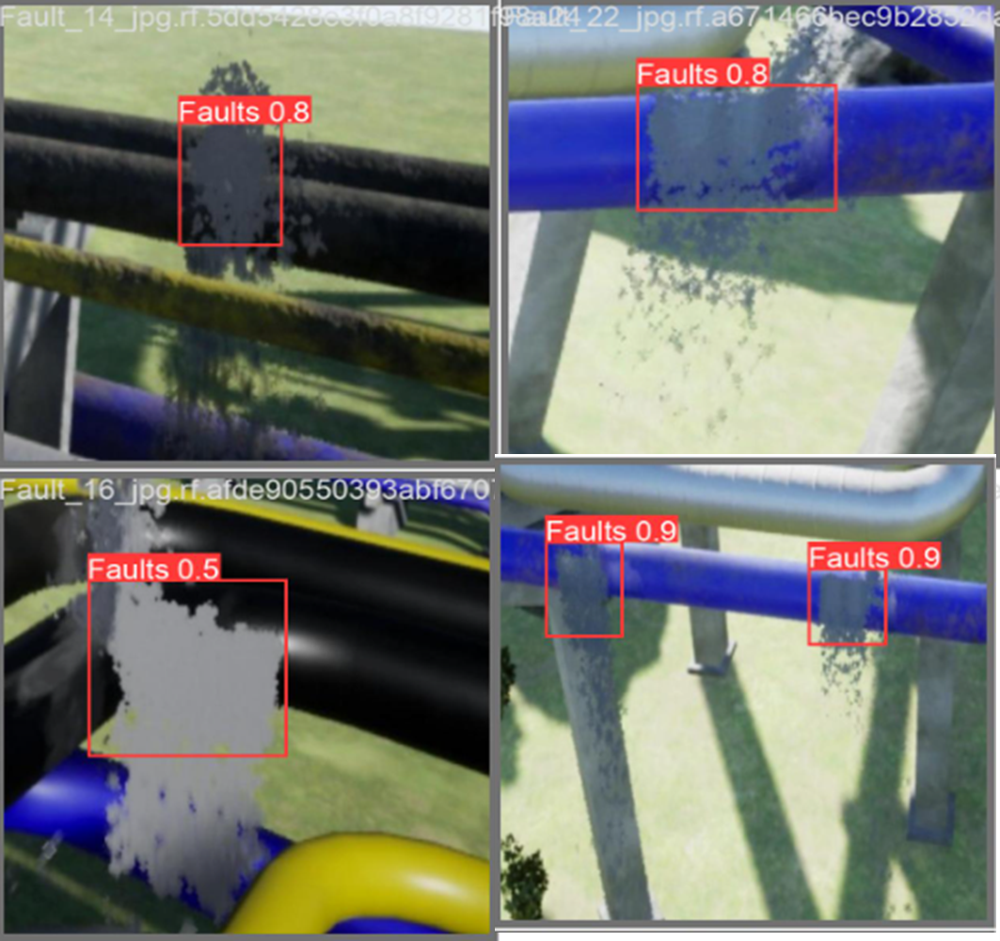

# An Intelligent Unmanned Aerial Vehicle For Detection of Pipeline Faults
An Intelligent Unmanned Aerial Vehicle For Detection of Pipeline Faults built on Microsoft Airsim
## Abstract
Leakages on Pipeline continues to be a problem in the petroleum sector, but this research presents the use of state of the art techniques in Robotics and Artificial Intelligence to tackle this menace. This project makes use of an intelligent drone enabled by computer vision algorithm to detect pipeline faults.
The Drone is able to perform the following
1. Real time 3D Reconstruction of the environment
2. Detection of Pipeline Faults using Computer Vision algorithm
3. Obstacle avoidance during drone navigation
4. Tracking of Pipeline path using Path Dijkstra's and A* algorithm

Video Demo :


[](https://www.youtube.com/watch?v=1v-ivv_LiHk)


## Installation 
1. [Unreal Engine 4.27](https://www.unrealengine.com/)
2. [Ubuntu 18.04 (WSL2)](https://ubuntu.com/tutorials/install-ubuntu-on-wsl2-on-windows-10#1-overview)
3. [Q Ground Countrol](http://qgroundcontrol.com/) on Windows
4. [Airsim](https://github.com/microsoft/AirSim) on Windows 
5. [PX4 SITL](https://microsoft.github.io/AirSim/px4_sitl/)

## Dependencies
```
python version >= 3.8
pip install open3d
pip install msgpack-rpc-python
pip install airsim
pip install pandas pillow tqdm
```


## Proposed Hardware Architecture
The Drone has a pay load of Depth Camera, RGB Camera and a LIDAR sensor
 


## Simulation Architecture
The simulation was carried out using Microsft Airsim on Windows and on Ubuntu 18.04 (WSL2)
 

## Simulation Environment
The simulation environment was built from scratch on the Unreal Engine 4.27 Platform. The Unreal engine provides a photorealistic simulation environment with High Visual Fidelity


 


## 3D Map Reconstruction
The 3D Map recosntruction was carried out using the fusion of the snesor readings from lidar sensor and the depth sensor. The segmentation point cloud gives better seen understanding of the environment.

## Computer Vision algorithm 
The You-Only-Look-Once v8 and Detection Transformer object detection model was used on the real-life dataset gotten from [Roboflow](https://universe.roboflow.com/zzi-driha/pipe-burst) . The syntehtic dataset was generated from the simulation environment and was trained on the Yolo v8 model. The weight from the training was tested in the simulation environment.
### A.Yolo v8
**Training on Real life Dataset**


[Google Colab Link](https://colab.research.google.com/drive/11Ii1Fham5Js4BOswlHylC8AnLLrh2yoR?usp=sharing)

**Training on Synthetic Dataset**



[Google Colab Link](https://colab.research.google.com/drive/170YHXG5TjJkWnKKu6tiyMteSWT8p_X48?usp=sharing)
### B. DETR (Detection Transformer)
Training on Real life Dataset

[Google Colab Link](https://colab.research.google.com/drive/1D17io_6CHbAzvv9_kcOSEk_DxorXZB88?usp=sharing)
## Pipeline Tracking and Obstacle Avoidance

### References
[1]
[2]
[3]
